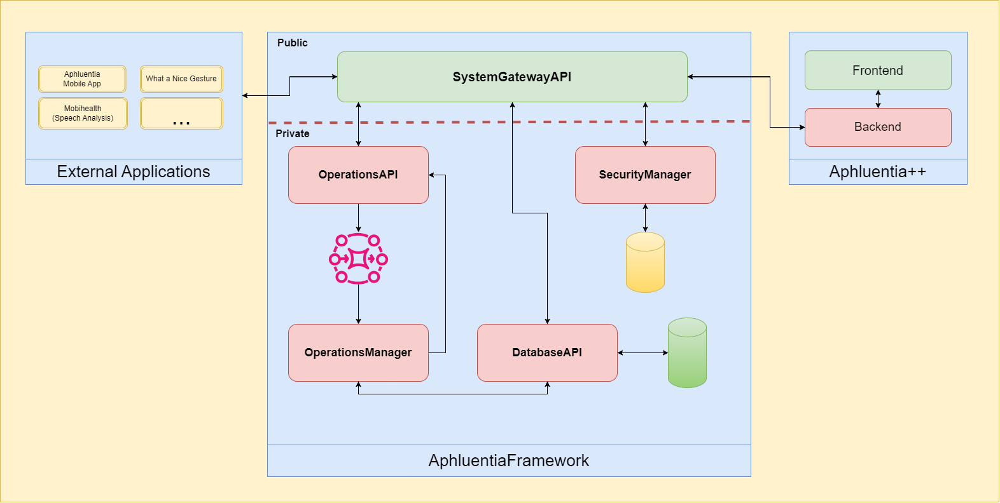
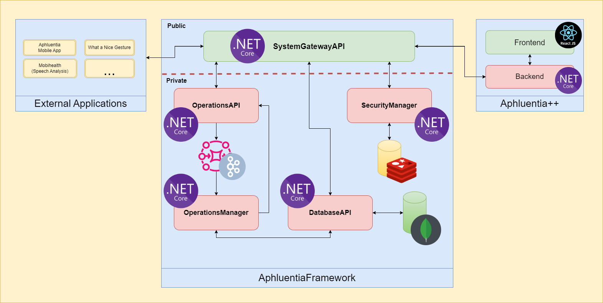

# Documentation  
Dissertation Documentation   
This repository contains diagrams and more information about the solution   


## Architecture  
The Solution has 3 main modules:   
- The Solution Has 2 Main Components:  
    - The Framework Itself, containing the Operations, Broker, Database and SystemGateway  
    - The Proof-Of-Concept Frontend denominated Aphluentia++





## Technology  
Some aspects where considered when taking into consideration the choice of technologies. These included the overall objective of the services 
(complexity), performance, previous experiences and useful libraries. It is also important that docker containerization will be used to
ensure cross-platform compatibility with each module  




## Dockerization  
Development, management and deployment of Docker containers was used in this work in all of the Framekwork's modules as such:  

Applications:   
- DatabaseAPI: HTTPS:9010  HTTP:8010   
- OperationsManager: HTTPS:9020  HTTP:8020   
- OperationsAPI: HTTPS:9030  HTTP:8030   
- SecurityManager: HTTPS:9040  HTTP:8040   
- SystemGatewayAPI: HTTPS:9050 HTTP:8050  

Components:  
- Redis: Port 6379  
- MongoDB: Port 27017
- Kafka Cluster:   
    - Zookeepers: Ports 2177, 2178 and 2179
    - Brokers: Ports 8095, 8096 and 8097 for internal communications and 9095, 9096 and 9097 for external communications


## Initialization  of the Framework

# Method 1: Creating and Deploying the docker images:  
In this folder, run- to intialize the KafkaCluster:    
``` 
docker-compose up  
```  

To initialize the Mongo database:   
```
docker run -d --name mongodb -p 27017:27017 -e MONGO_INITDB_ROOT_USERNAME=ROOT -e MONGO_INITDB_ROOT_PASSWORD=ROOT mongo    
```

To initialize the Redis Database:   
```
docker run --name my-redis -p 6379:6379 -d redis  
```

To Initialize the DatabaseAPI, go to the repository Database and inside /DatabaseApi run:

```
docker build . -t databaseapi  
docker run --name DatabaseApi -p 9010:443 -p 8010:80 -d databaseapi   
```


To Initialize the SecurityManager, go to the repository SecurityManager and inside /SecurityManager run:

```
docker build . -t securitymanager    
docker run --name SecurityManager -p 9040:443 -p 8040:80 -d securitymanager  
```


To Initialize the OperationsManager, go to the repository OperationsManager and inside /OperationsManager run:

```
docker build . -t operationsmanager    
docker run --name OperationsManager -p 9020:443 -p 8020:80 -d operationsmanager  
```


To Initialize the OperationsAPI, go to the repository OperationsAPI and inside /OperationsApi run:

```
docker build . -t operationsapi    
docker run --name OperationsAPI -p 9030:443 -p 8030:80 -d operationsapi   
```

Finally, you can run the SystemGatewayAPI, go to the repository SystemGateway and inside /SystemGatewayAPI run:  
```
docker build . -t systemgateway    
docker run --name SystemGateway -p 9050:443 -p 8050:80 -d systemgateway  
```


# Method 2: Automated Creation and Deployment of the Docker images with PowerShell:  
In a folder containing all the framework repositories (KafkaCluster, OperationsManager, OperationsAPI, SystemGateway, SecurityManager and Database) run the [Start.ps1](Start.ps1)  script. This script automatically builds and deploy the Docker images of the framework repositories.


## Initialization  of the Frontend
- No dockerization was implemented in the proof-of-concept frontend  
# Method 1: Running the projects:  
To Initialize the Proof-Of-Concept backend, go to the repository PlatformModule and inside /AphluentiaPlusPlus/Backend run:
```
dotnet run  
```

To Initialize the Proof-Of-Concept frontend, go to the repository PlatformModule and inside /AphluentiaPlusPlus/frontend run:
```
 npm run dev
```

# Method 2: Automated Initialization with PowerShell:   
Outside the PlatformModule repository folder, run the [StartFrontend.ps1](StartFrontend.ps1)  script. This script automatically runs the proof-of-concept frontend and backend.  
