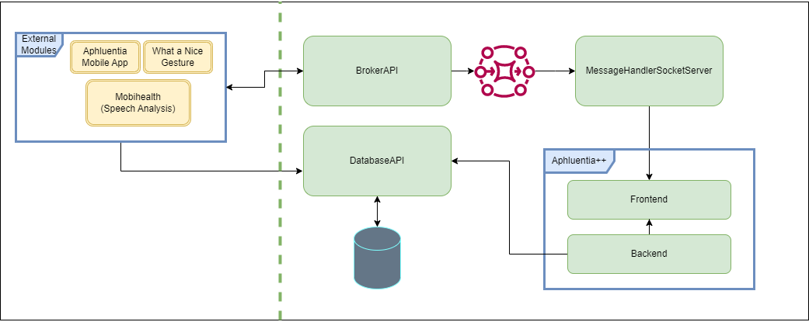

# Documentation  
Dissertation Documentation   
This repository contains diagrams and more information about the solution   

## Branch Schema  
**Each change to the repositories must be assigned with the corresponding issue or commit ID**   

Issue Labels:  
Issue Labels | Objective  
------------- | -------------  
bug | Correct identified bugs   
fix | Correct broken commits  
feature | Add a New feature  
documentation | Add documentation   
  

Branch Naming Schema :  
Branch Prefix | Branch Suffix  
------------- | -------------  
bug  | /{IssueName}#{IssueId}   
fix  | /{commitId}   
feat | /{IssueName}#{IssueId}     
documentation | /{IssueName}#{IssueId} 

## Architecture  
The Solution has 3 main modules:   
- The External Services Module (Aphluentia Mobile App, What a Nice Gesture, Mobihealth etc):   
    - These services can connect directly to the database to retrieve the necessary information  
    - These services need to communicate with the WebPlatform to notify of changes, pairing operations and heartbeat  

- The Aphluentia Platform Module (the to-be-developed web platform):     
    - Can connect directly to the database's CRUD methods  
    - Needs to communicate with the External Modules to notify of changes, pairing operations and heartbeat  
    - Must be responsive to changes in the External Modules

- The Database System (Solution's Database):   
    - A REST API which allows for CRUD Operations over the database  

Furthermore, some services have to be developed to allow for the communicate between the external services and the Aphluentia++ Platform Services
- Broker:
    - Allows for the notification of each service when a change has taken place    
- CommunicationAPI:    
    - External REST API which offers a standardized way of each service to connect to the Broker   
    - Sends to the broker change notifications, heartbeat requests and responses and pairing operation details

## Technology  
Some aspects where considered when taking into consideration the choice of technologies. These included the overall objective of the services 
(complexity), performance, previous experiences and useful libraries. It is also important that docker containerization will be used to
ensure cross-platform compatibility with each module  

- Broker: Apache Kafka  
    - Apache Kafka Broker is a well-known broker with a lot of documentation online   
    - Previous Experience  

- CommunicationAPI: FastAPI:     
    - This is a somewhat small module, FastAPI is a lightweight python framework to build RestAPIs   
    - FastAPI also has buil-in automatic swagger documentation   
    - FastAPI was developed to handle multiple concurrent request efficiently   
    - Previous Experience    

- Aphluentia++ Container: .NET Core Web App MVC:    
    - Libraries exist to update frontend and connect to broker     
    - Partial Pages updates   
    - Previous Experience   

- DatabaseAPI Container:    
    - .NET Core Web API has bult-in automatic swagger documentation    
    - Entity Framework Library is great to interact with database   
    - Previous Experience  

- Database Container: mySQL:   
    - Relational Database   
    - Previous Experience   